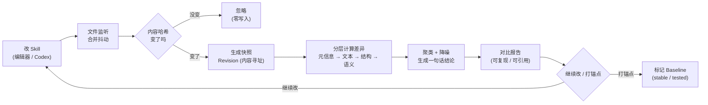
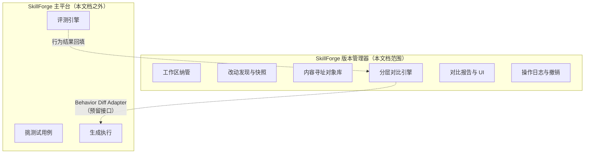
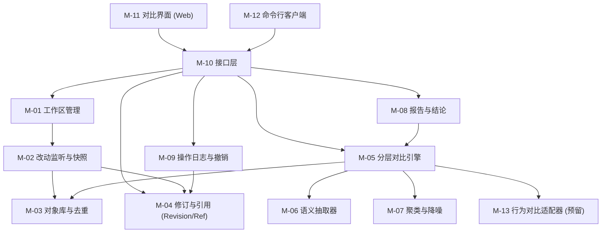
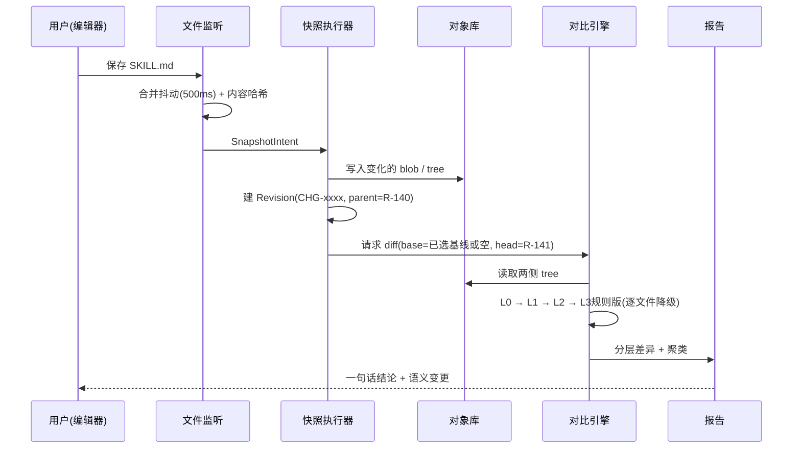
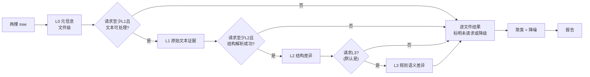

# SkillForge 版本管理器（Version Manager）设计文档

> **文档性质**：一份合并文档，同时承载三层内容——**产品定义 / 需求分析 / 技术实现**。
> **抽离说明**：本文描述的是从 SkillForge 主平台中**把「版本管理器」抽离出来**的版本。抽离后它只做一件事——**管理 Skill 的版本，并把版本对比做透**。
> **核心目标**：为 **Skill 的高频修改减负**。参考对象：Git 的对象模型、Jujutsu 的工作区自动快照、Difftastic 的结构化 diff，以及 GitHub 上各类 prompt / 数据版本管理方案。
> **文档版本**：v0.2.0　|　**状态**：目标设计，2026-10-08 完成契约整理；不代表功能已经实现。
> **阅读规则**：MVP 范围以 §8.1 为准；状态语义以 §7 为准；可交换数据、失败恢复及验收步骤见 [实现契约与验收](./SkillForge%20版本管理器实现契约与验收.md)。待决项见 §2.7，未关闭前不得由实现者自行猜定。实现进度以代码与验收证据为准。

---

## 目录

| 章节 | 内容 |
| --- | --- |
| 一 | [产品定义](#一产品定义) |
| 二 | [需求分析](#二需求分析) |
| 三 | [功能模块](#三功能模块) |
| 四 | [系统架构](#四系统架构) |
| 五 | [技术栈选型](#五技术栈选型) |
| 六 | [开源方案调研与借鉴](#六开源方案调研与借鉴) |
| 七 | [关键设计决策](#七关键设计决策) |
| 八 | [MVP 范围与里程碑](#八mvp-范围与里程碑) |
| 九 | [风险与开放问题](#九风险与开放问题) |
| 十 | [附录：术语与参考](#十附录术语与参考) |

---

# 一、产品定义

## 1.1 一句话定位

> **SkillForge 版本管理器（SkillForge VM）是一个为高频修改而生的 Skill 版本内核：保存即快照，比较即结论。用户只负责改，版本、快照、差异、对比全部自动完成。**

副标题：**把"这次改了什么、跟谁比、差在哪"从一件需要手工操作的事，变成一件默认发生的事。**

## 1.2 要解决的问题

Agent Skill 的形态是 Markdown / YAML / JSON / 提示词 / 少量资源文件的组合。它的迭代特点决定了传统版本工具不好用：

| 编号 | 问题 | 具体表现 |
| --- | --- | --- |
| P-1 | **版本仪式太重** | Git 的 `add / commit / message` 对一次"改了三行提示词"的修改来说成本过高，导致用户干脆不记版本 |
| P-2 | **版本爆炸** | 每保存一次就建一个版本，版本列表里全是"wip"，找不到有效锚点 |
| P-3 | **文本 diff 噪声大** | 重排一段列表、调整缩进、换行符从 LF 变 CRLF，都会让 diff 一片红绿，真正改的那两个词被淹没 |
| P-4 | **看不懂语义变化** | 行级 diff 无法回答"这条约束是被删了、还是被挪到别的段落了""工具调用里的参数是不是变了" |
| P-5 | **没有默认对比对象** | 每次都要想"我该跟哪个版本比"，用户被迫做选择 |
| P-6 | **对比结果不可复现** | 同一对版本在不同时间比出来的结果不一致，无法引用、无法归档 |
| P-7 | **改了不敢回退** | 没有可靠的操作记录，改坏了只能凭记忆手改回去 |
| P-8 | **版本与"为什么改"脱节** | 版本上没有任何轻量注解，三个月后回看完全不知道当时在干什么 |

**核心问题（唯一）：如何让 Skill 的每一次修改，都以接近零的操作成本，得到一个可信、可读、可复现的版本对比结论。**

## 1.3 产品是什么 / 不是什么

| 项 | 内容 |
| --- | --- |
| 产品类型 | Agent Skill 的版本管理与版本对比内核 |
| 归属 | 从 SkillForge 主平台抽离；既可独立运行，也可被主平台嵌入 |
| 用户只做 | **改 Skill** → **看对比** → **（可选）打一个锚点** |
| 系统负责 | 发现改动、生成快照、去重、分层对比、生成结论、记录操作、可撤销 |
| 核心原则 | **不制造仪式，不制造版本垃圾，把算力与注意力都放在"差异"上** |
| 不是 | 不是 Git 客户端，不是完整 VCS，不是 Agent 运行器，不是评测平台 |
| 明确不做 | 分支合并工作流、多人协作、云端仓库、Agent 执行、视频/行为生成 |

> **边界一句话**：版本管理器**不生产行为**，只生产**"版本"与"版本之间的差异"**。行为对比通过预留接口交给外部（主平台的测试链路）完成。

## 1.4 设计原则（五条）

| 原则 | 含义 | 落地要求 |
| --- | --- | --- |
| **零仪式** | 保存即快照，没有 add / stage / commit message 这道坎 | 用户不需要为"记录版本"做任何额外动作 |
| **默认自动化** | 对比对象、快照命名、差异分层都由系统自动决定 | 打开页面就能看到 "Working vs Baseline" 的对比 |
| **结果优先** | 先给结论，再给证据；先给语义，再给文本 | 默认视图是语义差异，"文本 diff"是最后才展开的一层 |
| **人只处理不确定性** | 规则能判的直接判，判不了才交给人 | 低置信度的变更标为"待确认"，不猜结论 |
| **降噪优先** | 减少红绿，提升信噪比 | 格式变化默认折叠；同一意图的多处改动聚类成一条 |

## 1.5 核心循环



## 1.6 核心对象模型

| 对象 | 一句话定义 | 是否用户可见 |
| --- | --- | --- |
| **Workspace（工作区）** | 一个被纳管的 Skill 目录 | 可见（一次性绑定） |
| **Skill** | 由多个文件、提示词、规则、资源组成的逻辑对象，**不对应单个文件** | 可见 |
| **Object（对象）** | 内容寻址的存储单元：`blob`（文件内容）/ `tree`（目录结构）/ `meta`（快照元数据） | 不可见 |
| **Revision（快照 / 修订）** | 某一时刻 Skill 全量内容的固化记录，有父修订、有时间、有触发方式 | 可见（历史列表） |
| **Change（变更）** | 从一个快照到另一个快照的差异集合，带**稳定 Change ID** | 半可见（用于引用） |
| **Series（变更序列）** | 一段连续的修改序列，用于区间对比 | 半可见 |
| **Baseline（基线）** | 用户显式打锚点后选定的默认对比基准；保存不会自动移动它 | 可见 |
| **Ref（引用）** | 命名指针，指向某个 Revision | 可见（打标动作） |
| **DiffReport（对比报告）** | 两个快照之间的分层差异 + 聚类 + 结论，**可复现、可归档、可引用** | 可见（核心产物） |
| **Op（操作）** | 对版本库的一次操作记录，支持撤销 | 不可见（但可 `undo`） |
| **Note（注解）** | 用户给某个 Revision 留的一句话，**可选、不强制** | 可见 |

**关键区分（避免踩坑）：**

- **Revision ≠ 用户版本**：快照每次改动都可能产生；**Baseline 才是用户认可的"版本"**。这样才不会"每保存一次就多一个正式版本"。
- **Change ID ≠ Revision ID ≠ tree OID**：tree OID 标识文件树；Revision ID 标识包含父修订与序号的不可变修订事件（§7.2）；**Change ID 在一次逻辑修改内保持不变**。回到历史内容可以复用 tree，但仍是新的修订事件。
- **DiffReport 是产物，不是过程**：报告一旦生成就有稳定标识，可以被引用、被贴进 issue、被主平台复用。

## 1.7 与 SkillForge 主平台的关系（抽离边界）



| 项目 | 归属 | 说明 |
| --- | --- | --- |
| 快照、去重、差异、报告、撤销 | **VM** | 抽离出来的部分，可独立发布 |
| 跑 Agent、生成、评测 | **主平台** | VM 只预留接口，不实现 |
| 行为差异（视频并排等） | **主平台** | 通过 `BehaviorDiffAdapter` 插槽接入 |
| 对比对象的命名与选择（revset） | **VM** | 主平台直接复用 VM 的 revset 语法 |

> **抽离带来的收益**：VM 可以脱离"要不要跑 Agent"独立交付，先解决最高频、最确定的那一半问题——**"这次到底改了什么"**。

## 1.8 成功标准

**总验收（唯一标准）：**

> 在一台机器上改一次 Skill → 不做任何版本操作 → 打开页面/敲一条命令 → 看到一份可读、可复现的语义级对比报告。**全程不需要 add、commit、填 message、选基线。**

| 指标 | 定义 | 目标 |
| --- | --- | --- |
| 记录一次修改的操作次数 | 从保存文件到"修改已被纳管"，用户需要几次额外操作 | **0 次** |
| 取得一次对比的操作次数 | 从有改动到看到对比报告 | **≤ 1 次** |
| 快照可见延迟 | 保存后多久页面上出现"有未纳管改动" | **≤ 2 秒** |
| 报告可读性 | 10 处实际语义修改中，报告能正确指出的条数 | **≥ 8 条** |
| 噪声比 | 主结论中纯格式/可证明无语义影响的重排条目占比；口径见实现契约 §5 | **≤ 10%** |
| 存储冗余 | 重复内容在对象库中的重复存储 | **0（内容寻址去重）** |
| 可复现率 | 同一不可变 Revision 对 + layer + 有效算法版本 → 相同规范报告 | **100%** |

---

# 二、需求分析

## 2.1 用户与典型场景

**唯一目标用户：开发、维护、优化 Agent Skill 的工程师。**

特征：用 Codex / 编辑器改 Skill；Skill 以 Markdown / YAML / JSON / 提示词形式存在；同一个 Skill 会长期、高频迭代；改了以后第一反应是"我这次到底动了什么、有没有副作用"。

**不做普通终端用户，不做多人协作。**

| 场景编号 | 场景 | 用户想要什么 |
| --- | --- | --- |
| S-1 | 刚改完一段提示词，想知道到底改了哪几处 | 一份"只说人话"的语义差异 |
| S-2 | 连续改了两个小时，中间保存了几十次 | 把这些散碎改动**折叠成几条有意义的变更** |
| S-3 | 想确认"这周相对上周稳定版，总共动了什么" | 区间对比 |
| S-4 | 改坏了，想查看或恢复 20 分钟前的状态 | 版本库状态可撤销；是否回写用户文件须先关闭 TBD-08 |
| S-5 | 想把某个状态标记为"已验证" | 打一个锚点，不建正式版本 |
| S-6 | 想在 PR / issue 里说明这次改动 | 一份可粘贴、可复现的报告 |
| S-7 | 想知道这次改动影响了哪些被引用的文件 | 影响面提示 |

## 2.2 高频修改的一天（用户旅程）

```
09:30  在编辑器里改 SKILL.md 的一段约束，保存
       → 系统自动：捕获改动 → 生成快照 R-141 → 与 Baseline 对比 → 报告就绪
       （用户什么都没做）

09:31  打开页面，默认看到「本次改动 · 语义视图」
       → "收紧输出格式约束 1 条；新增工具调用示例 1 条；删除冗余说明 2 条"
       → 看到 1 条标了「待确认」（约束被移动到了另一段，系统不确定是否是删除）

09:35  继续改，保存三次
       → 500 ms 静默窗口内合并快照请求；≤ 2 秒显示状态，报告按分层性能目标更新

11:00  觉得可以了 → 点一下「标记为已验证」
       → 打上 ref = tested，Baseline 自动前移

14:00  又改，改坏了 → skillforge-vm undo
       → 撤销上一步已记录的版本库操作；文件写回边界见 TBD-08，不能据此假定已恢复编辑器中的文件
```

**硬规则**：整条旅程里，用户**没有**执行 add / commit / 写 message / 选基线 / 选对比对象。

## 2.3 功能需求

> 编号规则：`FR-<模块号>.<序号>`。模块号对应第三章。

### FR-01 工作区与纳管

| 编号 | 需求 | 验收标准 |
| --- | --- | --- |
| FR-01.1 | 一次性绑定 Skill 目录 | `vm init <path>` 后立即可用，无需二次配置 |
| FR-01.2 | 支持一个服务纳管多个工作区 | 多个工作区并行时任务互不干扰 |
| FR-01.3 | 不入侵用户仓库 | 默认所有数据写在独立数据目录；**不往用户仓库写文件** |
| FR-01.4 | 可选 colocate 模式（后续） | MVP 仅独立数据目录；不得以此条授权向 Skill 目录写元数据 |
| FR-01.5 | 忽略规则 | 忽略目录/临时文件不纳管；已纳管的大文件与二进制保留原始内容，仅跳过文本/语义对比 |

### FR-02 改动发现与快照

| 编号 | 需求 | 验收标准 |
| --- | --- | --- |
| FR-02.1 | 自动发现改动 | 保存后 **≤ 2 秒**出现"有未纳管改动" |
| FR-02.2 | 抖动合并 | 有限突发保存后等待 500 ms 无新事件，再扫描稳定内容；5 次保存只提交 1 个最终快照；持续写入见 §7.2 |
| FR-02.3 | 内容哈希确认 | 内容不变（仅时间戳变）**不产生快照** |
| FR-02.4 | 快照去重 | 与当前已提交 tree 相同则不新增 Revision；与非当前历史 tree 相同则复用对象，但记录新 Revision（包括 A→B→A） |
| FR-02.5 | 手动触发 | 支持 `vm snapshot -m "..."`，但 message 可省略 |
| FR-02.6 | 变更 ID 稳定 | 同一逻辑修改在后续快照中保持同一 Change ID |
| FR-02.7 | 重命名识别 | 文件重命名且内容相似度 ≥ 阈值时，识别为"移动/重命名"而非"删除+新增" |

### FR-03 分层对比引擎

| 编号 | 需求 | 验收标准 |
| --- | --- | --- |
| FR-03.1 | L0 元信息层 | 文件数、行数、体积、token 估算、引用文件变化 |
| FR-03.2 | L1 文本层 | 行级 diff + 词级高亮；CRLF/LF 与末尾换行规范化 |
| FR-03.3 | L2 结构层 | 按类型解析为结构树（Markdown AST / YAML 树 / JSON 树）做节点级 diff |
| FR-03.4 | L3 语义层 | 抽出 Skill 语义单元（角色、能力、约束、工具、流程、样例、输出格式、参数）做增 / 删 / 改 / 移 |
| FR-03.5 | 分级计算 | 默认报告自动请求 L3 八类规则版；允许先呈现 L0/L1 进度，但未计算不能显示为“无语义变化”；显式 layer 可只取较低层 |
| FR-03.6 | 解析降级 | 单文件语法/编码不受支持时降级到可用层并注明原因；对象损坏、I/O 失败不是解析降级 |
| FR-03.7 | 格式噪声折叠 | 仅折叠已证明不改变含义的格式/重排；流程、数组顺序及 Markdown 有效缩进不视为噪声；原始差异可展开 |
| FR-03.8 | 变更聚类 | 同一意图的多处改动聚合为一条变更，带一句人话标签 |
| FR-03.9 | 影响面 | 给出"被引用文件是否变化"的提示 |
| FR-03.10 | 可复现 | 同一不可变 Revision 对、layer、有效 `algo_version`（含配置指纹）→ **逐字节相同**的规范报告 |

### FR-04 对比对象选择

| 编号 | 需求 | 验收标准 |
| --- | --- | --- |
| FR-04.1 | 默认对比对象 | 打开即得 `Working vs Baseline`，无需选择 |
| FR-04.2 | 引用式表达式 | 支持 `@`（工作区）、`stable`、`tested`、`last`、`<ref>~1`、`A..B` 等 |
| FR-04.3 | 任意两点对比 | 支持任选两个 Revision / Ref |
| FR-04.4 | 区间对比 | 支持"一段变更序列"整体对比，识别其中"哪些修改被后续改回去了" |
| FR-04.5 | 三方对比（预留） | 预留 `base / ours / theirs` 形态 |

### FR-05 基线、引用与注解

| 编号 | 需求 | 验收标准 |
| --- | --- | --- |
| FR-05.1 | 打锚点 | 一次操作把当前状态标为 `stable` / `tested` / 自定义名 |
| FR-05.2 | 基线自动前移 | 打锚点后，默认对比基准自动前移，无需手动改 |
| FR-05.3 | 可选注解 | 可给快照留一句话；**不填也能用** |
| FR-05.4 | 锚点不自动生成 | **系统绝不自动创建 Baseline**，避免版本垃圾 |

### FR-06 操作日志与撤销

| 编号 | 需求 | 验收标准 |
| --- | --- | --- |
| FR-06.1 | 记录所有操作 | 快照、打标、回退等操作全部记录，带父子关系 |
| FR-06.2 | 一键撤销 | 追加补偿操作恢复上一步版本库状态，**包括撤销撤销**；文件写回由 TBD-08 单独约束 |
| FR-06.3 | 状态可跳转 | 可查看历史操作点；恢复操作的状态载荷和写入边界按实现契约 §2 冻结后实现 |
| FR-06.4 | 不丢数据 | 未被显式清理的对象不因撤销而永久丢失 |

### FR-07 报告与界面

| 编号 | 需求 | 验收标准 |
| --- | --- | --- |
| FR-07.1 | 默认语义视图 | 报告首屏是语义差异，**默认展开** |
| FR-07.2 | 视图切换 | 语义 / 结构 / 文本 三档可切，切换不重算已缓存的部分 |
| FR-07.3 | 一句话结论 | 用固定模板生成，**不调用大模型** |
| FR-07.4 | 待确认清单 | 系统判不了的变更单独列出，**不许猜结论** |
| FR-07.5 | 并排与行内 | 支持并排视图与行内高亮；词级高亮 |
| FR-07.6 | 时间线 | 历史以时间线组织：锚点 / 快照 / 注解 |
| FR-07.7 | 报告导出 | 可导出为 Markdown / JSON，用于粘贴到 PR / issue |

### FR-08 命令行与接口

| 编号 | 需求 | 验收标准 |
| --- | --- | --- |
| FR-08.1 | CLI 与网页等价 | CLI 不直接读写数据库，只调服务，结果完全等价 |
| FR-08.2 | 核心命令 | MVP：`start / init / status / snapshot / diff / log / tag / undo / show`；`range-diff / export` 后续实现 |
| FR-08.3 | 统一返回外壳 | `ok / data / error / request_id` 四段式 |
| FR-08.4 | 具体错误 | 错误说明原因（如 `工作区未初始化`、`对象库不可写`）；解析降级是报告诊断，不能混成整个请求失败 |

### FR-09 行为对比接口（预留）

| 编号 | 需求 | 验收标准 |
| --- | --- | --- |
| FR-09.1 | 适配器插槽 | 定义 `BehaviorDiffAdapter` 接口，VM 内部零实现 |
| FR-09.2 | 双向契约 | VM 输出"要对比什么"（Revision 对 + 语义单元变化），外部回填"行为结果" |
| FR-09.3 | 无适配器时优雅降级 | 未注册适配器时，报告只呈现静态层，**并明确标注"未接入行为对比"** |

## 2.4 非功能需求

| 编号 | 类别 | 需求 |
| --- | --- | --- |
| NFR-01 | 性能 | 快照生成（无改动）**零写入**；快照生成（有改动 ≤ 1MB）≤ 300 ms |
| NFR-02 | 性能 | L0+L1 对比（单文件 ≤ 1MB）≤ 200 ms；L2 ≤ 1.5 s；L3 ≤ 3 s；**缓存命中 ≤ 100 ms** |
| NFR-03 | 容量 | 10000 次保存下，同一 OID 只存一份；体积按不同内容对象的累计压缩大小计量，不承诺整文件 blob 的增长等于修改字节数 |
| NFR-04 | 可复现 | 同一不可变 Revision 对、layer、有效算法版本（含分析配置指纹）→ 规范报告逐字节一致 |
| NFR-05 | 可靠性 | 进程强杀重启后，已提交状态完整可读，未完成操作可恢复或安全重试；断电持久性不等同于进程强杀 |
| NFR-06 | 可靠性 | 单个文件解析失败不影响其余文件与整体报告 |
| NFR-07 | 可用性 | **断网仍可完成快照与全部静态对比**；除用户自配模型外数据不出本机 |
| NFR-08 | 可移植 | Windows / macOS / Linux 行为一致（含路径与换行处理） |
| NFR-09 | 轻依赖 | **不引入 Redis、Celery、消息队列、外部数据库、Node 运行时（对终端用户）** |
| NFR-10 | 可扩展 | 新增一种文件类型的结构解析器 / 语义抽取器，**不改调度、存储与接口** |
| NFR-11 | 可维护 | 模块间只走约定接口，不跨层直读数据库 |
| NFR-12 | 无侵入 | 默认不修改用户仓库任何文件；不安装 Git 钩子 |
| NFR-13 | 内存 | 服务空闲内存 ≤ 300 MB |
| NFR-14 | 许可 | 引入 GPL 组件时只能以独立进程调用，**不得打进主安装包** |

## 2.5 异常与边界场景

| 编号 | 如果 | 那么系统必须 |
| --- | --- | --- |
| EDGE-01 | 第一次用，还没有任何 Baseline | 以"零基线"模式对比（Working vs 空），流程照走，不报错 |
| EDGE-02 | 保存后内容与上次完全一致 | 直接复用对象与报告，**不新增 Revision、不重复计算** |
| EDGE-03 | 保存风暴（编辑器连续写盘） | 重置 500 ms 静默窗口；持续写入不得伪报快照成功，稳定性校验与重试见 §7.2 |
| EDGE-04 | 文件被整体重命名 / 移动 | 识别为移动，不产生"删除+新增"两条噪声 |
| EDGE-05 | 换行符 CRLF ↔ LF 变化 | 原始字节改变仍保存新快照；报告判为格式变化并折叠，不生成语义变更结论 |
| EDGE-06 | 文件解析失败（语法错误） | 该文件降级到 L1；非文本则止于 L0；报告注明原因，其余文件继续 |
| EDGE-07 | 超大文件 / 二进制资源 | 保留可读回的完整 blob，不进文本层；报告仅展示元信息和哈希并注明跳过原因 |
| EDGE-08 | 修订数量过多导致 log 卡顿 | 使用稳定游标分页与已有序号索引；pack/gc 为后续功能，不自动删除历史 |
| EDGE-09 | 磁盘写不进去 / 空间不足 | 操作失败，但已完成的记录完整保留，**不留半截状态** |
| EDGE-10 | 服务崩溃后重启 | 未完成操作标记"已中断"，数据不丢，可重跑 |
| EDGE-11 | 端口被占用 | 自动换端口；CLI 与网页仍能找到服务 |
| EDGE-12 | 用户手工回滚了整个目录 | 复用历史内容对象但提交新 Revision；只有确知外部来源才标 external，普通监听不推断用户意图 |
| EDGE-13 | 系统时间被改 | 顺序以**单调计数器 + 内容哈希**为准，不依赖墙上时钟排序 |
| EDGE-14 | 模型服务不可用（后续可选聚类标签） | 使用规则标签；模型不得参与差异分析或改写已冻结的报告正文 |
| EDGE-15 | 同一工作区并发触发 | 单一写通道 + 工作区级互斥，**绝不并行写** |

## 2.6 需求优先级与验收

| 优先级 | 含义 | 包含 |
| --- | --- | --- |
| **P0（MVP 内）** | 没有它闭环跑不通 | 以 §8.1 为唯一范围清单：包含 L3 八类规则版、基础待确认标记、基础历史列表和报告 JSON；不把所有 FR 的后续扩展一并纳入 |
| **P1（之后补）** | 显著提升体验 | 完整语义扩展、区间/三方对比、独立结构视图、专门待确认面板、时间线增强、导出、CDC、pack/gc、colocate |
| **P2（远期）** | 平台化 | 行为适配器实现、Git 互操作、远端同步、IDE 薄入口；M-13 最小契约仍随 MVP 文档交付 |

**MVP 验收（唯一）：**

> 改一次 Skill → 不做任何版本操作 → 看到"Working vs Baseline"的语义级对比报告 → 可标记锚点 → 可撤销。

## 2.7 待决项（开工前需闭环）

| 编号 | 事项 | 状态 / 决定 | 负责人 / 关闭条件 |
| --- | --- | --- | --- |
| TBD-01 | 语义单元 schema | 已定最小字段，见实现契约 §3；八类以外的配置扩展后续做 | B 维护，A 校验报告消费示例 |
| TBD-02 | Revision / Change 身份 | 已定，见 §7.2 / §7.3；示意 ID 不可用于真实持久化 | A 维护，首个写入任务补编码固定样例 |
| TBD-03 | 数据位置 | 已定：MVP 仅独立目录，禁止数据目录落入 Skill 根内 | A；colocate 不阻塞 MVP |
| TBD-04 | 大文件 | 已定：MVP 整文件 blob；默认文本上限 2 MiB，超过上限或非 UTF-8/二进制只做 L0；CDC 后续设计 | A 存储 / B 降级，不提前激活预留分块参数 |
| TBD-05 | Git 互操作 | 后续 P2 | 不阻塞 MVP |
| TBD-06 | L3 与模型 | 已定：默认八类规则版；MVP 不接模型；后续仅可选聚类标签 | B；不得让模型生成差异或结论 |
| TBD-07 | 清理与保留 | MVP 不自动删历史/报告；refcount 不是删除授权；保留根/宽限期在 gc 开工前另行冻结 | A/B；不阻塞 MVP |
| TBD-08 | undo 是否写回用户文件 | **待产品决定**：现行 AGENTS 禁止写入，故当前只能设计版本库状态撤销，不能宣称能恢复编辑器文件 | 用户决定；M-09 文件恢复实施前必须关闭，见实现契约 §2 |
| TBD-09 | 操作状态的持久化与恢复 | **待技术冻结**：定义当前 Revision、选中 Baseline、活动 Change、当前 Op 的载体与 before/after 状态；当前 DDL 尚无完整状态协议 | A 主责、B 消费方；M-04/M-09 写状态前补具体映射、失败重放样例和必要迁移方案 |

已定项仍是目标契约，不代表代码已满足；待决项只阻塞其依赖任务，不阻塞其他独立工作。任何新待决项必须写清负责人、影响范围和关闭条件，不能把“倾向方案”当成已经冻结的接口。

---

# 三、功能模块

## 3.1 模块总览



| 模块 | 名称 | 职责一句话 | 前台可见 |
| --- | --- | --- | --- |
| M-01 | 工作区管理 | 纳管 Skill 目录、加载配置与忽略规则 | 是（一次性） |
| M-02 | 改动监听与快照 | 发现改动、合并抖动、触发快照 | 否 |
| M-03 | 对象库与去重 | 内容寻址存储、blob/tree、分块去重、回收 | 否 |
| M-04 | 修订与引用 | Revision / Change / Ref / Baseline 的元数据与解析 | 是（历史） |
| M-05 | 分层对比引擎 | L0~L3 四层差异计算与缓存 | 是（对比页） |
| M-06 | 语义抽取器 | 把 Skill 文件抽成语义单元 | 否 |
| M-07 | 聚类与降噪 | 折叠格式噪声、聚合同意图变更、打标签 | 否（结果可见） |
| M-08 | 报告与结论 | 组织报告结构、生成一句话结论、导出 | 是（核心） |
| M-09 | 操作日志与撤销 | 记录操作 DAG、撤销与状态跳转 | 否（命令可见） |
| M-10 | 接口层 | 路由、校验、统一返回、事件推送 | 否 |
| M-11 | 对比界面 | 语义/结构/文本三视图、并排与行内、时间线 | 是 |
| M-12 | 命令行客户端 | 与服务等价的命令入口 | 是 |
| M-13 | 行为对比适配器 | 预留插槽，把行为差异并入报告 | 预留 |

## 3.2 模块明细

### M-01 工作区管理

- 绑定目录，生成工作区标识；数据只写入独立目录，路径解析后拒绝落入 Skill 根内（含相同路径）。
- 配置内容：忽略规则、文件类型 → 解析器映射；语义扩展、分块、清理字段是后续预留，不因模型已有字段就宣称功能可用。
- **文件优先于界面**：配置通过文件维护；完整校验成功才原子切换有效配置，非法配置保留上次有效值并给出具体诊断；每次任务固定一份配置快照。
- 初始化须在对象和数据库完整后发布工作区可见标志；失败可重试，不能留下“已纳管但数据库不存在”的状态。详见实现契约 AC-01。

### M-02 改动监听与快照

- 基于文件监听（自带抖动合并）+ 内容哈希二次确认。
- 快照前做一次全量比对兜底（防止监听丢失事件）。
- 输出：`SnapshotIntent`（哪些文件、什么类型的变化）。第 2 周实现中，快照执行器以「稳定扫描 → 写对象树 → 同事务提交 Revision/Change」直接落地该意图，暂未单独物化 `SnapshotIntent` 数据模型。
- 与 M-03 协作：只写入**变化的 blob**，未变化的部分复用已有对象。
- 同一服务的快照提交串行；监听只产生提示，启动扫描和快照前扫描负责兜底。读取期间文件变化须重试，不提交已知混合状态（§7.2）。

### M-03 对象库与去重

- 三层对象：`blob`（文件内容）/ `tree`（目录结构 + 文件名 + 模式）/ `meta`（快照元数据）。
- 命名：`SHA-256`，分两级目录存放，压缩存储。
- blob 保存原始字节，格式规范化仅作用于对比派生视图。
- 读回必须校验编码、长度及 OID；损坏对象不得继续用于报告，不能伪装成解析降级。
- MVP 全部使用完整 blob；CDC、回收和打包后续实现。对象可达性是未来删除依据，refcount 仅为派生索引。

### M-04 修订与引用

- Revision 字段：ID、Change ID、父 Revision、根 tree、时间、触发方式、来源（监听/手动/外部变更）。
- Ref：用户命名指针；`stable`、`tested` 为建议锚点名，首次使用不存在；`last` 为只读修订别名。
- **revset 解析器**：MVP 仅 `@`、`last`、完整 Revision ID、`<ref>`、`<rev-or-ref>~N`；不支持 `stable-1` 这类别名或完整表达式语言。`A..B` 与区间分析后续实现。
- 当前状态、基线选择和活动 Change 的持久化须先关闭 TBD-09；不得由接口层与存储层分别保存一套真值。

### M-05 分层对比引擎

| 层 | 输入 | 输出 | 成本 |
| --- | --- | --- | --- |
| L0 元信息 | 两个 tree | 文件级增减改、体积、token 估算 | 极低 |
| L1 文本 | 两个 blob | 行级 + 词级 diff，含规范化 | 低 |
| L2 结构 | 两个结构树 | 节点级 diff（增/删/改/移） | 中 |
| L3 语义 | 两组语义单元 | 单元级 diff + 人类可读描述 | 中高 |

- 原始字节相同的文件不再解析；其余文件独立做结构/语义分析。结构等价可折叠展示，但不删除原始文本证据；不得只解析变动行而漏掉上下文。
- 结果缓存：键 = `(base_rev, head_rev, layer, algo_version)`；有效 `algo_version` 含规则、解析器和分析配置指纹（§7.7）。
- 单文件语法失败仅降低该文件的计算层级；对象损坏中止本次报告，不能返回“无变化”。

### M-06 语义抽取器

内置单元类型（可扩展）：

| 单元 | 说明 |
| --- | --- |
| `role` | 角色 / 身份定义 |
| `capability` | 能力与职责 |
| `constraint` | 约束、禁止项、边界 |
| `tool` | 工具 / 函数调用及其参数 |
| `workflow` | 流程步骤与顺序 |
| `example` | 示例与少样本样例 |
| `output_format` | 输出格式与结构要求 |
| `parameter` | 配置项与默认值 |

**原则**：抽取器是做**类型无关的通用抽取**（基于 Markdown 结构 + YAML/JSON 键路径），而不是给每个 Skill 定制解析。

- 语义单元必须携带文件路径、原始字节位置和规则证据；最小交换结构见实现契约 §3。
- 不能可靠归类的文本保留在 L1/L2；无法确认的匹配写入 `needs_review`，不得凭关键词给出肯定的删除/移动结论。
- 示例、代码块、引用中的指令与正文约束区分；工作流和数组顺序变化是有效变更。规则正确性用固定样例验收，不以展示出的条目数代替准确性。

### M-07 聚类与降噪

- **噪声判定规则**（可解释、可关）：仅折叠有证据的无语义影响变化；流程顺序、数组顺序、代码缩进、Markdown 硬换行和文本否定不得粗暴归入噪声。
- **聚类**：按"文件邻近 + 语义单元类型 + 关键词命中"把多处改动聚成一条，生成人话标签（规则模板优先，模型可选）。
- **不确定性标注**：无法判定"删除 vs 移动"时标 `needs_review`。

### M-08 报告与结论

报告骨架（顺序即呈现顺序）：

```
结论（一句话，模板生成）
└ 概览（文件数 / 变更条数 / 聚类数 / 风险标记）
  └ 语义变更（默认展开）
    └ 结构变更（可展开）
      └ 文本变更（可展开）
        └ 元信息（文件清单、体积、token、影响面）
          └ 待确认项
```

- 风险标记：命中"删除约束""修改工具参数""大范围重排"等模式时提示。
- MVP 返回规范报告 JSON，包含有效 `algo_version` 与稳定报告 ID；独立 Markdown/JSON 文件导出后续做。
- 每条结论必须能追溯到单元与两侧原文；未计算、已降级与无变化是不同状态，不允许空数组代替这三种含义。

### M-09 操作日志与撤销

- 操作 DAG：每个操作记录父操作与前后状态引用。
- `undo` 追加补偿操作，撤销撤销也追加记录；不删除既有 Revision/Op。`restore <op>` 的写入范围受 TBD-08/TBD-09 约束。
- **不做物理删除**，直到回收执行。

### M-10 / M-11 / M-12

- 接口层：统一返回外壳、具体错误码、事件流（快照就绪 / 对比完成 / 降级发生）。
- 界面：MVP 提供结论、语义/文本两视图、待确认标记与基础历史列表；独立结构视图和增强时间线后续做。
- 命令行：与服务完全等价；`diff` 默认 `Working vs Baseline`。

### M-13 行为对比适配器（预留）

```python
class BehaviorDiffAdapter(Protocol):
    def supports(self, workspace) -> bool: ...
    def compare(self, base_rev, head_rev, focus_units) -> BehaviorResult: ...
```

- VM 只负责传递"要对比什么"和接收"行为结果"，**不实现执行与评测**。

## 3.3 模块依赖约束

- 上层只能调用下层的**公开接口**，禁止跨层直读数据库。
- 新增解析器 / 语义抽取器 / 行为适配器，**不需要改 M-02 / M-03 / M-10**。
- M-05 是唯一允许同时接触对象库与解析器的模块。
- 表的读写归属和跨线交付物见实现契约 §1。HTTP/Web/CLI 不执行 SQL；共享事务由业务提交入口组织，不让路由拼接多个独立提交。

---

# 四、系统架构

## 4.1 分层架构

```
┌──────────────────────────────────────────────┐
│  入口层   Web 对比界面(M-11) │ CLI 客户端(M-12)  │
├──────────────────────────────────────────────┤
│  接口层   HTTP 路由 / 校验 / 统一返回 / 事件流    │
├──────────────────────────────────────────────┤
│  业务层   快照 │ 对比 │ 报告 │ 引用 │ 撤销       │
├──────────────────────────────────────────────┤
│  能力层   解析器(结构) │ 语义抽取器 │ 聚类器      │
├──────────────────────────────────────────────┤
│  适配层   行为对比适配器(预留) │ 模型标签(后续)    │
├──────────────────────────────────────────────┤
│  底座     对象库 │ SQLite 元数据 │ 文件监听 │ 日志  │
└──────────────────────────────────────────────┘
```

| 进程 | 职责 | 并发 |
| --- | --- | --- |
| 主服务 | 接口、调度、状态机 | 1 |
| 文件监听 | 感知工作区改动 | 1（每工作区） |
| 快照执行器 | 写对象、建 Revision | **1，串行**（保证对象库一致） |
| 对比执行器 | 分层 diff 计算 | 2~4（可调） |

> **串行边界**：MVP 每个服务一个快照写队列，按工作区公平调度；每个工作区的对象库与 SQLite 独立，不承诺跨工作区去重。序号、Revision、引用与操作日志必须有唯一提交顺序。多服务进程不得同时写同一个数据根；占用时明确报错。对比任务读取已提交的不可变状态，可并发。

**成功提交边界**：稳定读取 → 写入并校验不可变对象 → 一个 SQLite 事务提交对象索引、Revision、Change、引用与 Op → 提交成功后发布事件。文件系统与 SQLite 不是一个事务：数据库失败可以留下不可见的未引用对象，但不允许已提交 Revision 指向未完成对象。初始化发布、恢复与故障验收见实现契约 §2 / §5。

## 4.2 核心数据流



## 4.3 对象存储与去重

**设计来自 Git 的内容寻址模型。**

| 层次 | 内容 | 去重方式 |
| --- | --- | --- |
| blob | 文件内容（不含文件名） | 内容哈希完全一致 → 只存一份 |
| tree | 目录条目（名字、模式、指向 blob/子 tree） | 子树哈希一致 → 复用 |
| meta | 修订事件编码等规范 JSON | 相同编码仍复用；不同事件通常因父/序号等不同而生成新 OID |
| chunk（后续） | 大二进制分块 | MVP 不产生该类型；启用前另定编码与兼容方案 |

**收益与上限**：改一个文件里的三行，会产生该文件的完整新 blob，以及从该文件到根的变化 tree；未变化的 blob/子 tree 复用。存储量按不同对象的累计压缩大小计量，另计文件系统分配开销与元数据。整文件去重不等于行级增量存储，不承诺增长等于修改的三个文本行大小。

### 4.3.1 MVP 存储格式（与现有编码对齐）

- 编码：ASCII 头部 `<type> <body字节长度>` + 单个 NUL 字节 + body；OID 为整个编码的 SHA-256，小写 64 位十六进制；压缩为 zlib。
- 路径：`objects/<oid前2位>/<oid第3至4位>/<完整oid>`。所有外部传入 OID 先校验语法，不能作为任意路径片段。
- blob：原始文件字节；禁止写入前转换换行、去 BOM、去空白、改编码。
- tree：UTF-8 JSON，形如 `{"entries":[{"mode":"100644","name":"SKILL.md","oid":"…"}]}`；键排序、无额外空白、保留非 ASCII，条目按 name 的 UTF-8 字节排序。name 为单个路径分量，不能是空串、`.`、`..`、绝对路径或含分隔符/NUL；同目录名不得重复。
- meta：同一规范 JSON 编码；MVP 修订身份见 §7.2。现有 `revision` 无 `meta_oid` 字段，不允许实现者自行追加表字段。
- 读回依次验证 OID、解压、头部类型、主体长度及完整编码哈希；缺失报 `object_not_found`，损坏报 `object_corrupted`。合法压缩但内容被替换也必须识别。
- 临时对象同目录写入后原子替换，不能先发布半成品；本次实际读取/复用的已有对象需确认有效，不要求每次扫描整个历史对象库。不要把 `os.replace` 误认为文件系统与数据库的共同事务。
- MVP 不跟随符号链接、目录 junction/reparse point 及特殊文件；跳过并给出诊断，避免越界读取和循环扫描。普通目录和文件才纳管，尚未支持的类型不得静默宣称已备份。

**回收（后续）**：以 Revision、Ref、Op 恢复状态和已保留报告的可达性为删除依据；refcount 是可重建索引，当前值为 0 不能证明对象可删。保留根、宽限期与恢复策略未冻结前，MVP 不自动删除对象或报告。

## 4.4 对比引擎（分级）



| 决策 | 结论 | 理由 |
| --- | --- | --- |
| 解析失败怎么办 | UTF-8 文本降级到 L1；二进制/编码不支持/超文本上限止于 L0，报告标注 | 单文件失败不影响其余文件；存储错误另行失败 |
| L3 何时算 | 默认报告自动计算八类规则版；显式请求较低层则不算 | 首屏语义结论不应依赖用户额外展开 |
| 缓存粒度 | 按层缓存 | 用户切换视图时不必重算 |
| 算法版本 | 参与缓存键 | 算法升级后不出现"旧报告被新算法污染" |

## 4.5 数据模型

**SQLite（WAL 模式）存放元数据，对象库以文件形式存放内容。**

以下为当前 `db/schema.py` 的字段清单，**不代表各表的业务已实现**。完整 DDL 与实际约束以该文件为准；例如 `(ws_id, seq)` 当前只有普通索引，并没有唯一约束。业务提交仍须保证工作区内序号唯一递增；需加约束时先提交 schema 版本、已有数据兼容/迁移和失败回滚方案，不得因补文档直接改表。

| 表 | 关键字段 | 说明 |
| --- | --- | --- |
| `workspace` | `id, name, root_path, data_path, config_json, created_at` | 工作区 |
| `object` | `oid, type, size, storage, refcount, created_at` | 对象索引 |
| `revision` | `rev_id, ws_id, change_id, parent_rev_id, root_tree_oid, trigger, source, ts, seq` | 快照（`seq` 为单调序列） |
| `change` | `change_id, ws_id, first_rev, last_rev, summary, cluster_json` | 变更 |
| `ref` | `name, ws_id, rev_id, updated_at` | 命名引用 |
| `blob_index` | `rev_id, path, oid, mode, size` | 便于按路径查历史 |
| `diff_cache` | `cache_key, layer, algo_version, result_json, created_at` | 差异缓存 |
| `report` | `report_id, ws_id, base_rev, head_rev, algo_version, payload_json, created_at` | 对比报告 |
| `op` | `op_id, ws_id, parent_op_id, kind, payload_json, ts` | 操作日志 |
| `note` | `id, rev_id, text, created_at` | 可选注解 |

**报告 JSON 骨架：**稳定字段、状态及位置定义见实现契约 §3；下面 ID 为占位示例，不是可计算的验收样例。可变 ref 标签只在展示上下文返回，不进入规范正文。

```json
{
  "report_id": "RPT-9f2c",
  "schema_version": "1",
  "algo_version": "diff-1+<有效分析配置指纹>",
  "layer": "L3",
  "base": { "rev": "R-140" },
  "head": { "rev": "R-141", "change_id": "CHG-kq3m" },
  "overview": { "files": 1, "changes": 1, "clusters": 1, "risk": "low" },
  "clusters": [
    { "id": "c1", "label": "新增输出约束", "units": ["u12"] }
  ],
  "layers": {
    "metadata": { "status": "computed", "files": [{ "path": "SKILL.md", "op": "add" }] },
    "semantic": { "status": "computed", "units": [
      { "id": "u12", "path": "SKILL.md", "kind": "constraint", "op": "add", "before": null, "after": { "path": "SKILL.md", "start_byte": 0, "end_byte": 17, "text": "必须输出 JSON" }, "rule_id": "constraint.required.v1" }
    ]},
    "structure": { "status": "computed", "nodes": [{ "path": "SKILL.md", "op": "add", "node_type": "paragraph", "before": null, "after": { "path": "SKILL.md", "start_byte": 0, "end_byte": 17, "text": "必须输出 JSON" } }] },
    "text": { "status": "computed", "hunks": [{ "path": "SKILL.md", "before": null, "after": { "path": "SKILL.md", "start_byte": 0, "end_byte": 17, "text": "必须输出 JSON" } }] }
  },
  "needs_review": [],
  "degraded": [],
  "behavior": null
}
```

## 4.6 接口设计

**统一返回外壳**：`{ ok, data, error, request_id }`。

路由表均相对 `/api`；成功 `error=null`，失败 `data=null`，错误结构固定为 `{code,message,detail}`。错误码、HTTP 映射、默认参数及事件交付语义见实现契约 §4。本节后续接口不构成 MVP 开工授权，不能注册空壳成功响应。

| 要干什么 | 接口 |
| --- | --- |
| 建工作区 | `POST /workspaces` |
| 工作区状态（是否有未纳管改动） | `GET /workspaces/{ws}/status` |
| 手动快照（message 可空） | `POST /workspaces/{ws}/snapshots` |
| 修订列表 | `GET /workspaces/{ws}/revisions` |
| 修订详情 | `GET /workspaces/{ws}/revisions/{rev}` |
| 变更列表 | `GET /workspaces/{ws}/changes` |
| 对比（核心） | `GET /workspaces/{ws}/diff?base=&head=&layer=` |
| 对比概览 | `GET /workspaces/{ws}/diff/summary?base=&head=` |
| 区间对比（后续） | `GET /workspaces/{ws}/range-diff?from=&to=` |
| 打锚点 | `POST /workspaces/{ws}/refs` |
| 撤销 | `POST /workspaces/{ws}/ops/{op}/undo` |
| 恢复状态（先关闭 TBD-08/09） | `POST /workspaces/{ws}/ops/{op}/restore` |
| 报告导出（后续） | `GET /reports/{report_id}/export?format=md\|json` |
| 行为对比（预留） | `POST /workspaces/{ws}/behavior-diff` |

**事件流**：`GET /workspaces/{ws}/events`，提交后推送 `snapshot/created`、`diff/ready`、`parse/degraded`；`gc/done` 为后续事件。事件是通知，数据库与状态接口是真值；断线重连先重取状态，不承诺持久消息队列语义。

**命令行：**

```bash
skillforge-vm start                # 启动本机服务；可自动打开网页
skillforge-vm init <path>          # 服务启动后，一次性绑定
skillforge-vm status               # 有没有改动、跟谁比
skillforge-vm snapshot             # 手动快照（可省略）
skillforge-vm diff                 # 默认 Working vs Baseline
skillforge-vm diff stable @~3      # 引用式对比
skillforge-vm range-diff stable @  # 后续：区间对比
skillforge-vm log                  # 时间线
skillforge-vm tag tested           # 打锚点
skillforge-vm undo                 # 撤销
skillforge-vm export --md          # 后续：导出报告
```

> **CLI 只是服务的客户端**：它不直接读写数据库，所以 `skillforge-vm diff` 与网页上点按钮**完全等价**。

## 4.7 运行与部署形态

| 形态 | 说明 |
| --- | --- |
| 本地优先 | 服务跑在本机，浏览器连本地端口；数据、对象库全在本地磁盘 |
| 独立发布 | 安装包 → `start`（启动本机服务）→ `init <path>`；业务 CLI 只调服务，服务未启动时明确提示 |
| 被嵌入 | 作为库被 SkillForge 主平台引入；主平台注册 `BehaviorDiffAdapter` 即可获得行为对比 |
| 演进 | 本地网页 + CLI → 桌面套壳 → IDE 薄入口 → 云端同步（远期可选） |

## 4.8 性能与容量目标

| 阶段 | 目标 |
| --- | --- |
| 抖动窗口 | 最后事件后的 500 ms 静默期，不计入执行耗时 |
| 扫描 + 内容哈希（≤ 1 MiB 文本） | 静默期结束后计时，≤ 200 ms |
| 无改动判定 | 0 次写盘 |
| 快照写入（≤ 1 MB 变化） | ≤ 300 ms |
| L0 + L1 对比（≤ 1 MB） | ≤ 200 ms |
| L2 结构对比 | ≤ 1.5 s |
| L3 语义对比 | ≤ 3 s（缓存命中 ≤ 100 ms） |
| 页面首屏 | ≤ 1 s |

**计时口径**：快照写入从稳定扫描结果就绪计到事务提交；≤ 2 秒指最后一次有限突发保存后可见状态，不等于 L3 已完成；首屏 ≤ 1 秒允许展示处理中状态。性能记录固定机器/磁盘、文件数、字节数、冷/热缓存与重复次数；语义性能不能用降级结果冒充。统一以 MiB（2²⁰ 字节）解释本节输入规模，详细验收见实现契约 §5。

**容量**：以 10000 次保存事件、单个 Skill ≤ 5 MiB 文本 + ≤ 200 MiB 资源的固定样例测量。无内容变化时对象/修订数不增长；有变化时按唯一 blob/tree/meta 的累计压缩大小与实际分配空间分别报告，SQLite 目标 ≤ 500 MiB。重复内容去重、变化大文件写放大和元数据增长分别统计。

---

# 五、技术栈选型

## 5.1 选型总表

| 用途 | 选型 | 为什么 |
| --- | --- | --- |
| 后端语言 | **Python 3.11+** | 与 SkillForge 主平台一致，可直接嵌入；解析生态（tree-sitter、YAML、Markdown）成熟 |
| 网络服务 | **FastAPI + uvicorn** | 原生异步；统一校验与事件推流都是现成的 |
| 数据校验 | **Pydantic** | 一套模型同时管配置、接口报文、报告结构 |
| 元数据存储 | **SQLite（WAL）** | 零运维、单文件、可复制即备份，满足单机单用户 |
| 对象库 | **自研（内容寻址）+ zlib** | Git 的思路自己实现，避免与用户 Git 仓库耦合 |
| 大文件去重 | MVP 整文件 blob；**CDC 后续评估** | 先保证原文可读回，不在首版增加第二套存储格式 |
| 文件监听 | **watchfiles** | 自带抖动合并，跨平台稳定 |
| 哈希 | **SHA-256** | 抗碰撞、长度可控；不用 MD5/SHA-1 |
| 任务调度 | **进程内队列 + SQLite 已提交业务状态** | 重启重扫恢复；当前没有通用任务状态表，不提前引入任务框架 |
| 文本 diff | **自研行级（Myers/Histogram）+ 词级高亮** | 逻辑集中在一处，便于"可复现"约束 |
| 结构化解析 | **tree-sitter（Python 绑定）** | Markdown / YAML / JSON 解析质量高，跨语言 |
| 结构 diff | **自研树匹配**（借鉴 difftastic / gumtree 思路） | 需要与语义单元对齐，直接套用外部工具反而不灵活 |
| 可选结构 diff 增强 | **difftastic（外部进程，可选）** | 用户想更强时挂上；GPL/MIT 边界清晰（独立进程调用） |
| 语义抽取 | **规则 + 结构树遍历** | 可解释、零成本、稳定 |
| 聚类标签（可选） | **任意 OpenAI 兼容小模型** | 只用于生成一句人话标签，**可完全关闭** |
| 前端 | **Vite + React + TypeScript** | 对比视图需要状态管理，但不值得上重框架 |
| 对比视图组件 | **CodeMirror 6 MergeView** | 轻、快、可控；大文件场景再评估 Monaco |
| 命令行 | **Typer / Click** | 与服务等价、参数校验友好 |
| 打包 | **pipx + 预构建前端产物** | 终端用户**不需要装 Node** |

## 5.2 关键选型理由

| 决策 | 结论 | 反面方案为什么不选 |
| --- | --- | --- |
| 直接内嵌 Git（`pygit2` / `dulwich`） | **不选**，自研轻量对象模型 | 会把"不入侵用户仓库"这条承诺打破；Git 的 index / branch / merge 概念对 Skill 场景全是负担 |
| 直接用 Difftastic 当唯一引擎 | **不选**，作为可选增强 | 它不懂 Skill 语义单元；且需要额外的 GPL 边界处理与二进制分发 |
| 直接用 jsdiff / diff-match-patch 做全部文本 diff | **不选**，只借鉴算法与词级高亮 | 需要"规范化 + 可复现 + 算法版本"三件事自控 |
| 用向量数据库做语义对比 | **不选** | 目标不是"语义相似检索"，而是**确定性的结构差异**；向量结果不可复现 |
| 引入 Redis / 消息队列 | **不选** | 单机单用户，纯增加部署负担（沿用主平台约束） |
| 用大模型做差异分析 | **禁止** | 差异必须可复现、可解释；后续模型只保留"聚类标签"这一个可选出口 |

## 5.3 明确不引入

- Redis / Celery / 消息队列 / 外部数据库
- 向量数据库、嵌入模型（不做语义检索）
- 云端账号、鉴权、多租户
- 前端重量级框架（Next.js 之类）
- 任何会将用户 Skill 内容发送到远端的默认行为

---

# 六、开源方案调研与借鉴

> 本章回答一个具体问题：**"Git 和 GitHub 上的开源方案，哪些值得抄、哪些必须绕开？"**

## 6.1 调研结论一览

| 方案 | 类型 | 对我们的价值 | 结论 |
| --- | --- | --- | --- |
| **Git** | 版本控制 | 对象模型 / 快照式存储 / 三层 diff / reflog / range-diff | **抄数据模型，弃交互仪式** |
| **Jujutsu (jj)** | 版本控制 | 工作区即提交 / 稳定 Change ID / Op-log / 无暂存区 | **抄交互哲学，弃 rebase 体系** |
| **Sapling** | 版本控制 | Change ID 与 hash 分离、栈式体验 | **只抄 Change ID 思想** |
| **difftastic** | 结构化 diff | 语法树比较、忽略格式噪声、失败回退、最小编辑路径 | **抄算法思路，作为可选增强** |
| **tree-sitter** | 解析器 | Markdown / YAML / JSON 的健壮解析 | **直接采用** |
| **gumtree** | AST diff 研究 | 自顶向下 + 自底向上树匹配、移动检测 | **抄匹配策略** |
| **jsdiff / diff-match-patch** | 文本 diff | 词级高亮、语义清理、相似度 | **抄算法，不抄实现** |
| **diff2html / CodeMirror MergeView / Monaco diff** | 对比 UI | 并排/行内视图、折叠、词级高亮 | **前端直接复用，不自研渲染** |
| **git range-diff** | 区间对比 | 把"一串修改"当整体比较，识别被改回去的部分 | **抄概念，用于 Series 对比** |
| **Git LFS / DVC / lakeFS** | 大文件版本 | 大文件外置 + 指针；内容哈希命名 | **抄思路，不做远程** |
| **restic / borg** | 备份去重 | 内容定义分块与块级去重 | **抄 CDC 参数设计** |
| **promptfoo / Langfuse / LangSmith** | Prompt 版本管理 | 版本号 + label + 回滚 + 版本对比 UI + 数据集关联 | **抄概念模型，不引入运行时** |

## 6.2 Git：抄什么、不抄什么

**抄（数据模型与算法层面）**

- **内容寻址对象库**：blob 只存内容不存文件名；tree 存目录结构；相同内容全局只存一份。这是"10000 次修改也不膨胀"的根本原因。
- **快照式而非差分式存储**：每次记录完整状态，但未变化的部分复用对象——兼顾"随时可比较"与"空间可控"。
- **三层结构**：工作区 / 索引 / HEAD 的三方视角，本质是"可以比较任意两个状态"，我们保留这个能力。
- **`.gitattributes` 式的 diff driver 思路**：按文件类型选择不同的 diff 策略。
- **reflog 思路**：任何操作都能找回——升级为我们的 Op-log。
- **packfile / delta 压缩思路**：对象多了要打包，不能一直是松散对象。
- **`range-diff`**：区间对比，解决"这一串修改和上一串相比到底变了什么"。

**不抄（交互与概念层面）**

| 不抄的东西 | 原因 |
| --- | --- |
| `add / stage / index` 仪式 | 用户改的是提示词，不是要发布的功能；暂存区只会增加认知负担 |
| commit message 必填 | 大多数修改说不出话；改为**系统自动生成摘要**，注解可选 |
| branch / merge / rebase | Skill 迭代是线性的高频小改，不需要分支模型 |
| detached HEAD / checkout 颠簸 | 用户不该因为"看历史"而改变工作区状态 |
| 写入用户仓库 | 默认独立数据目录，**不污染用户的 `.git`** |
| 行级 diff 作为主视图 | 噪声太大；主视图是语义层 |

## 6.3 Jujutsu：最值得抄的交互哲学

Jujutsu 对我们最有价值的四点：

| jj 的设计 | 我们的对应设计 |
| --- | --- |
| **工作区即提交**：保存即进入版本历史，无 `add` | **保存即快照**：监听触发，用户零操作 |
| **Change ID 与 commit hash 分离**：改写后 Change ID 不变 | **Change ID 稳定**：`CHG-xxxx` 在后续快照中延续 |
| **Op-log**：每个操作可撤销，可跳到任意状态 | **M-09 操作日志与撤销** |
| **无暂存区**：减少"三棵树不同步"的 bug 来源 | 只保留"工作区状态"与"快照"，天然对齐 |

**不抄**：stacked commits、自动 rebase、匿名分支、冲突作为一等对象——这些解决的是"代码协作史重写"问题，不是 Skill 迭代问题。

## 6.4 Difftastic / tree-sitter：结构化 diff

- **抄**：把文件解析成语法结构再比较，从而**忽略纯格式变化**；解析失败时**回退到文本层**；用最小编辑路径保证 diff 简洁；并排展示。
- **抄**：移动检测——重排一段列表示"移动"而不是"删除 + 新增"。
- **不抄**：30+ 语言全覆盖（我们只需要 Markdown / YAML / JSON / 纯文本 + 少量模板）；不做独立 CLI 工具形态。
- **关于使用方式**：作为**可选的外部进程增强**（用户想开就开），主路径是自研树匹配，因为它必须和语义单元对齐。

## 6.5 对比 UI 类

| 方案 | 借鉴点 |
| --- | --- |
| CodeMirror 6 MergeView | 轻量并排/内联合并视图，控件可组合 |
| Monaco diff editor | 大文件虚拟滚动与成熟折叠体验（作为备选） |
| diff2html | git diff 输出 → 可读 HTML 的渲染约定 |
| jsdiff / diff-match-patch | 词级高亮与语义清理的前端算法 |

**共性结论**：diff 渲染**绝不自研**，只做"语义层 → 通用 diff 结构"的转换。

## 6.6 Prompt 版本管理类（promptfoo / Langfuse）

这两个方案告诉我们"prompt 版本管理"已经被验证过，但它们的重心在**协作、部署、生产观测**：

| 它们有 | 我们要不要 | 我们的做法 |
| --- | --- | --- |
| 版本号 + label（如 production / staging） | **要** | Ref + Baseline（`stable` / `tested`） |
| 回滚 | **要** | Op-log 撤销 |
| 版本对比 UI | **要** | 本文档核心 |
| 与数据集/评测关联 | **要（接口预留）** | `BehaviorDiffAdapter` |
| 云端托管、多租户、SDK 上报 | **不要** | 本地优先，数据不出本机 |

## 6.7 大文件与去重类

| 方案 | 借鉴点 | 我们的取舍 |
| --- | --- | --- |
| Git LFS | 大文件外置 + 仓库里只留指针 | 借鉴内容寻址思想；MVP 完整资源存在独立对象库，报告仅展示元信息 |
| DVC / lakeFS | 数据版本与代码版本解耦 | 抄：对象库与元数据库分离 |
| restic / borg | 内容定义分块（CDC），块级去重 | 抄参数思路；不做加密备份管线 |

## 6.8 借鉴汇总（一页结论）

| 我们要做的事 | 谁的答案最好 | 我们的落地 |
| --- | --- | --- |
| 存储不膨胀 | Git | 内容寻址 blob/tree + 引用计数回收 |
| 用户零操作 | Jujutsu | 监听即快照，无 add/commit |
| 引用稳定 | Jujutsu / Gerrit | 稳定 Change ID |
| 改错了能回 | Jujutsu | Op-log + undo |
| diff 没噪声 | difftastic | tree-sitter 结构树 + 格式噪声折叠 |
| diff 能被看懂 | 自研 | 语义单元级差异 + 聚类标签 |
| 对比有默认对象 | jj revset | revset 式表达式，默认 Working vs Baseline |
| 区间对比 | git range-diff | Series 对比 |
| 前端渲染 | CodeMirror / Monaco / diff2html | 复用，不自研 |
| 大文件 | LFS / restic | MVP 整文件保真，后续再评估分块 |

---

# 七、关键设计决策

## 7.1 为什么不直接内嵌 Git

| 维度 | 内嵌 Git | 自研轻量对象模型 |
| --- | --- | --- |
| 用户仓库 | 会写入 `.git`，破坏"无侵入"承诺 | 独立数据目录，零污染 |
| 概念负担 | 需要接受 index / branch / HEAD | 只有"工作区 / 快照 / 对比"三个概念 |
| 语义层 | Git 不感知 Skill 语义 | 原生支持语义单元 |
| 交互 | 需要在 Git 之上再造一层 UI | 直接对准"对比"这一个目标 |
| 兼容性 | Git 版本差异、Windows 路径坑 | 自己可控 |

**结论**：抄 Git 的**数据模型**，不抄它的**交互模型**。MVP 仅独立数据目录；`colocate` 与 Git 互操作为后续设计，不构成本阶段写用户目录的许可。

## 7.2 快照粒度与合并策略

| 决策 | 结论 | 理由 |
| --- | --- | --- |
| 什么触发快照 | 当前原始文件树与上次已提交 tree 不同 | 文件内容、路径、受支持的模式变化均计入；mtime 不计入 |
| 合并窗口 | 最后事件后等待 500 ms 静默；持续事件每 2 秒尝试稳定扫描 | 有限突发可合并，持续保存也不无限延后扫描 |
| Change 何时延续 | 同工作区、没有显式边界且上次有效修改后未空闲满 30 分钟 | Change 只是时间/操作分组，不声称理解人的真实意图 |
| Change 何时结束 | 打锚点、撤销/恢复、空闲达到 30 分钟、服务重启 | 下一次实际内容变化才分配新 Change，不生成空 Change |

**Revision 身份（目标契约）**：`rev_id` 为一个 meta 对象的 OID；其规范 JSON 固定包含 `schema_version=1, ws_id, change_id, parent_rev_id, root_tree_oid, trigger, source, ts, seq`，不包含自身 ID。该 meta 先持久化，随后同事务插入 `revision` 行；通过 `rev_id` 读 meta，无需新增 `meta_oid` 列。`ts` 为创建时固定的 UTC 时间，显示用途；顺序由工作区内从 1 开始的已提交 `seq` 确定，不依赖墙上时钟。例图 `R-140`/`CHG-xxxx` 均为说明性缩写。

**无变化与回退**：A→A 不写对象、数据库、Op、不分配新 seq；A→B→A 的第三步写新的修订事件，复用 A 的 blob/tree，不能复用旧 Revision 代替这次事件。手动 snapshot 的 message 不得绕过无变化规则制造空快照；需要注解时走注解操作。

**稳定读取**：扫描前后核对目录清单、文件身份、大小/mtime，读取遇删除、替换或变化时放弃本次候选并重新扫描；连续 3 次不稳定则保持待处理状态、给出可重试诊断，等待下一轮。事件到来使扫描结果失效。普通文件系统不提供跨文件事务，系统不能承诺捕获编辑器未暴露的中间状态或多文件原子保存；验收保证稳定后最终状态不漏记、已检测到的不稳定状态不提交。

**生命周期值**：`trigger` 取 `init|watch|manual`；`source` 取 `initial|edit|external`。只有可证明的外部来源标为 external，普通监听无法区分“手工回滚”与“编辑成旧内容”，两者都必须正确保存 A→B→A。空闲分组在同次进程内使用单调时钟，重启开启新的 Change。

**这解决了 P-2（版本爆炸）**：快照可能很多，但**用户看到的"变更"很少**。

## 7.3 Change ID 方案

- 32 字节随机数，每个十六进制半字节 `0123456789abcdef` 映射到 `zyxwvutsrqponmlk`，前缀 `CHG-`；正文 64 字符。此处固定映射，不另造第二种编码。
- 在 Revision 首次创建时分配；后续同属一个变更的 Revision 继承同一 Change ID。
- 用途：跨快照引用"那次修改"；作为报告与外部系统的稳定键。

## 7.4 对比对象的选择：revset 式表达式

| 表达式 | 含义 |
| --- | --- |
| `@` | 请求进入写队列完成稳定扫描后，解析为本次捕获的已提交 Revision；不使用不可归档的虚拟 Revision |
| `stable` / `tested` | 用户显式创建的锚点名；不存在时显式请求报 `ref_not_found` |
| `last` | 该工作区已提交 seq 最大的 Revision；只读别名，禁止用户同名打标 |
| `<ref>` | 任意命名引用 |
| `<rev-or-ref>~N` | 沿 parent 往前 N 个修订，N 为非负整数；越界明确报错 |
| `A..B`（后续） | 区间表达式，不在 MVP 接受后伪装为两端 diff |
| 缺省 | 当前选中的 Baseline 与 `@`；无 Baseline 则 base 为 null（空树），不偷偷创建 stable |

打任意用户锚点后选中它作为默认 Baseline；后续保存只推进工作状态，不推进基线。一次比较把双方引用解析并固定为 Revision ID，执行中引用移动不影响本次结果。选择状态的持久化按 TBD-09 冻结；HTTP 与 CLI 使用同一个解析入口。零基线用 `base.rev=null` 表达，禁止用空字符串或伪造 Revision 行。

**这是"1 次点击出对比"的技术前提**：默认值必须是最常用的那一对。

## 7.5 降噪与变更聚类

三层降噪，逐层减少红绿：

1. **原文保真**：快照保存原始字节。规范化只生成内存中的比较视图，并保留到原文位置的映射；不能改写 blob 或用户文件。
2. **结构等价判定**（L2）：比较含节点值与顺序的结构，不只比较节点类型。等价结构可折叠展示，原始文本 diff 仍可访问。
3. **噪声规则**（M-07）：CRLF/LF 等已证明不影响含义的变化可折叠；不能统一 trim 行尾、排序数组或忽略标点。Markdown 两空格硬换行、YAML/代码缩进、workflow 顺序、字符串中的空白都可能有含义，未知情况保留并标待确认。

聚类在“人工标为不超过 5 个意图的 20 处改动”样例上收敛为不超过 5 条命名变更；不得强行合并无关改动来满足数量指标。聚类不能丢掉底层变更 ID，语义准确率在聚类前计算。

## 7.6 与行为对比的接口预留

设计边界要一次说清：

- VM **不做**：跑 Agent、生成产物、评测打分。
- VM **做**：产出"这次修改在语义层改了哪些单元"，并接收行为结果。
- 报告里行为差异的位置**提前留好**：`report.behavior = null | BehaviorResult`。
- 未接入时，报告显式标注"未接入行为对比"，**不给任何伪结论**。

## 7.7 缓存与可复现

| 约束 | 做法 |
| --- | --- |
| 同一输入 → 同一报告 | 键为 `(base_rev或null, head_rev, layer, algo_version)`；先解析可变 ref，不用 ref 名缓存 |
| 有效算法版本 | 代码/规则版本 + 解析器及语法版本 + 影响输出的配置规范 JSON 的 SHA-256；配置变化必须产生新版本键 |
| 报告可归档 | 规范正文落库；`report_id` 为 `RPT-` 加缓存键规范 JSON 的 SHA-256；无随机/请求时间 |
| 算法升级不污染旧报告 | 旧报告冻结在其 `algo_version`，新对比走新版本 |
| 排序确定性 | 一切列表按 `(path, unit_kind, position, id)` 稳定排序；路径相对根且用 `/`，排序按 UTF-8 字节，禁止依赖集合迭代顺序 |

正文 JSON 固定 UTF-8、键排序、紧凑分隔符、非 ASCII 不转义、不含 NaN/Infinity、无结尾换行。`request_id`、生成时间、耗时、机器绝对路径、用户当前 ref 标签位于外壳/运行日志，不进入正文。零基线、空列表和 null 有唯一含义。规范报告存储不包含可变展示信息；模型标签/外部行为结果若后续接入，另存版本化附加产物，不能原地改写已冻结规则报告。

同一版本必须能重算得到相同字节，不能只靠缓存命中伪装可复现。对象缺失/损坏不得缓存为空差异。临时 I/O 错误不生成成功报告；语法降级结果携带确定原因码，可作为该固定输入的报告保存。重新分析旧 Revision 时应用哪份配置必须显式：默认使用本次任务固定的有效分析配置，因此配置不同会得到不同 `algo_version`。

---

# 八、MVP 范围与里程碑

## 8.1 MVP 边界

**划分标准**：不是功能完整度，而是"跑通核心闭环的前提下，把工作量压到最低"。

**三条减负铁律**：**文件优先于界面 · 规则优先于模型 · 复用优先于自研。**

| 档次 | 内容 |
| --- | --- |
| **必须做（MVP 内）** | 工作区纳管；文件监听 + 抖动合并 + 内容哈希；保真对象库（blob/tree/meta）；Revision / Change / Ref；L0/L1/L2 + L3 八类规则版；聚类与噪声折叠；规范报告 JSON + 一句话结论 + 基础待确认标记；Web 语义/文本两视图、并排与基础历史列表；核心 CLI；Op-log 与 undo（须关闭相关待决项）；SQLite 元数据；本机安装包；M-13 最小类型契约但零实现 |
| **之后再补** | L3 自定义扩展、区间/三方对比、独立结构视图、专门待确认面板、增强时间线、独立报告导出、CDC、pack/gc、colocate、模型标签 |
| **远期** | 行为对比适配器实现、Git 互操作、云端同步、IDE 薄入口 |

**必须砍掉**：分支/合并、多人协作、账号权限、云端、配置界面、向量语义检索、行为执行与评测。

## 8.2 三个阶段

| 阶段 | 做什么 | 通过标准 |
| --- | --- | --- |
| **第一步：地基（第 1–2 周）** | 工作区、对象库、监听、修订、SQLite；并行验证文本/解析/语义样例 | 初始化失败可重试；损坏可检出；有限保存突发合并；原文相同零写入；A→B→A 正确记录 |
| **第二步：对比闭环（第 3 周）** | L0~L3 规则版、报告、Web/CLI、默认对比与零基线、锚点、Op/undo | 完整用户流程可跑；改 10 处正确指出 ≥ 8 处；待决项已关闭，不能以“接口占位”算通过 |
| **第三步：交付打磨（第 4 周）** | 故障恢复、质量/性能/可复现验收、缓存、安装包 | 固定意图样例聚类≤5条；噪声≤10%；性能达标；断网可用；终端用户无需 Node |

## 8.3 完成定义

> 在一台机器上改一次 Skill → 不做任何版本操作 → 看到一份语义级对比报告 → 打锚点 → 可撤销。**全程零仪式。**

各任务除正常路径外，须通过相关失败恢复用例；验收矩阵见实现契约 §5。固定样例覆盖八类单元、增删改移、否定词、流程顺序、示例/代码块、格式变化及解析失败。正确识别率按人工标注的真实变更逐条匹配（聚类前），误报单列；不得通过修改预期值、隐藏漏报或关闭规则来“通过验收”。未测的平台、构建或性能必须标为未验证。

---

# 九、风险与开放问题

| 风险 | 影响 | 应对 |
| --- | --- | --- |
| 语义抽取规则覆盖不足 | L3 出现"改了但没识别到" | 规则版先覆盖 8 类高频单元；报告保留 L2/L1 作为兜底可展开 |
| 树 diff 在超大 Markdown 上变慢 | 对比体验下降 | 按块处理 + 缓存；超过文本上限只做 L0 并注明原因 |
| 聚类标签质量不稳（若启用模型） | 标签误导 | 默认可关闭；标签必须可溯源到规则或单元 ID |
| 对象库写放大 | 变化大文件产生完整新 blob | 先测量并明确容量边界；不牺牲原文保真，CDC/gc 后续设计 |
| "不入侵仓库"承诺被破坏 | 用户信任受损 | MVP 独立目录并校验路径；文件恢复受 TBD-08 单独约束 |
| 两人团队维护成本 | 范围膨胀 | 以 8.1 的"必须做"清单为唯一开工范围；接口在第一周冻结 |
| 与主平台接口漂移 | 行为对比接入失败 | `BehaviorDiffAdapter` 契约与主平台共享同一份 schema |

**明确接受的债务**

- 不做合并与冲突解决（Skill 迭代按线性处理）
- 不做多人协作与鉴权（只绑本机）
- 语义层无法覆盖"自定义 DSL 型 Skill"
- 报告不含行为结论（那是主平台的职责）

---

# 十、附录：术语与参考

## 10.1 术语表

| 术语 | 含义 |
| --- | --- |
| Workspace | 被纳管的 Skill 目录 |
| Revision | 一次不可变修订事件（meta 对象 OID，含父/序号；不是 tree OID） |
| Change | 一次逻辑修改，跨多个 Revision 保持稳定 ID |
| Baseline / Ref | 用户显式打标的锚点；Baseline 是当前选中的默认对比基准 |
| revset | 选择对比对象的引用式表达式 |
| L0~L4 | 元信息 / 文本 / 结构 / 语义 / 行为 五层差异 |
| Report | 可复现、可归档的对比报告 |
| Op-log | 操作日志，支撑撤销与状态跳转 |

## 10.2 参考链接

- Git 对象模型与内容寻址存储：[Git Internals — Git Objects](https://git-scm.com/book/en/v2/Git-Internals-Git-Objects)、[Git's database internals I: packed object store](https://github.blog/open-source/git/gits-database-internals-i-packed-object-store/)
- Jujutsu（工作区即提交 / Change ID / Op-log）：[jj 官方 FAQ](https://docs.jj-vcs.dev/latest/faq/)、[github.com/jj-vcs/jj](https://github.com/jj-vcs/jj)
- Difftastic（结构化 diff）：[difftastic.wilfred.me.uk](https://difftastic.wilfred.me.uk/)、[github.com/Wilfred/difftastic](https://github.com/Wilfred/difftastic)
- tree-sitter：[tree-sitter.github.io](https://tree-sitter.github.io/tree-sitter/)
- Prompt 版本管理参考：[Langfuse Prompt Management](https://langfuse.com/docs/prompt-management/get-started)、[Promptfoo](https://www.promptfoo.dev/docs/configuration/prompts/)
- 前端对比视图：[CodeMirror MergeView](https://codemirror.net/docs/ref/#merge)、[Monaco Editor](https://microsoft.github.io/monaco-editor/)

## 10.3 与 SkillForge 主平台文档的对应关系

| 本文档章节 | 对应主平台文档 |
| --- | --- |
| 一、产品定义 | 《SkillForge 产品定义文档》第 2、7、9 节 |
| 二、需求分析 | 《SkillForge 需求文档》第 2、3、4、5 节（收窄到版本与对比） |
| 三～五、模块/架构/技术栈 | 《SkillForge 技术实现文档》第 2、4、5、6 节（抽出版本管理部分） |
| 六、开源借鉴 | 本文新增 |
| 七、关键决策 | 对应主平台技术文档第 6 节"关键决定"，但结论已按"只做版本管理"重写 |

---

> **一页总结**
>
> **抄 Git 的对象模型（不膨胀），抄 Jujutsu 的交互哲学（零仪式），抄 difftastic 的 diff 思路（少噪声），抄 promptfoo / Langfuse 的概念模型（版本 + 锚点 + 对比）。**
>
> **最终只做一件事：让 Skill 的每一次修改，都自动变成一份看得懂、信得过、找得回的版本对比。**
